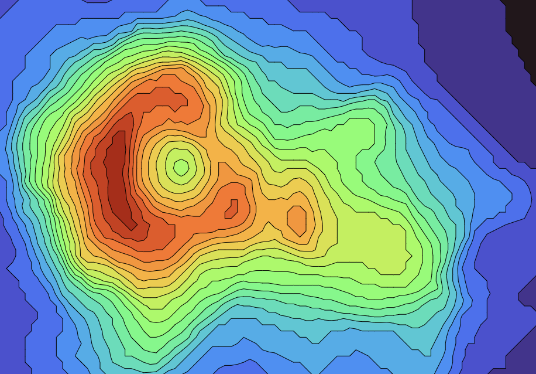

# micrograd
<<<<<<< HEAD

This implementation showcases micrograd, an autograd engine with built-in backpropagation, along with a neural network library layered on top of it as shown in this [video](https://www.youtube.com/watch?v=VMj-3S1tku0&list=PLAqhIrjkxbuWI23v9cThsA9GvCAUhRvKZ). Everything is the same for now. The next step is to train the MLP on a large dataset.  

=======
>>>>>>> e116f13a2fafae6fb46c74b84f8df9b083e651f5
